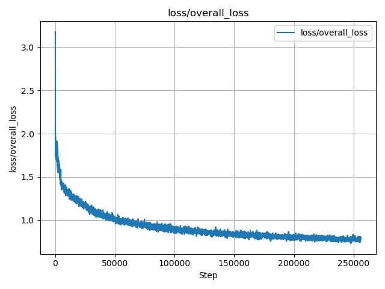
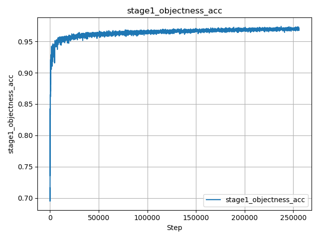

# FESS‑Grasp 🌟

**Code and training logs for our paper on multi-stage grasp detection**

---

## 🗂️ Repository Structure

FESS‑Grasp/
├── .gitignore
├── LICENSE
├── README.md
├── requirements.txt
├── results/ # Training curves (PNG)
│ ├── loss_curve.png
│ └── accuracy_curve.png
├── logs_csv/ # Scalar data in CSV format
│ ├── loss_overall_loss.csv
│ └── stage1_objectness_acc.csv
├── export_tensorboard_scalars.py
└── plot_csv_metrics.py


---

## 📊 Training Metrics

### 📉 Loss Curve



### 📈 Accuracy Curve



> These curves are exported from TensorBoard logs (`.tfevents` files) for clarity and reproducibility.

---

## 📁 CSV Data Files

We also export raw scalar values for fine-grained analysis:

- `loss_overall_loss.csv`: Training loss over steps  
- `stage1_objectness_acc.csv`: Accuracy in stage 1

---

## 🛠️ How to Regenerate Logs

1. Export from TensorBoard UI (`...` → `Download CSV`)
2. Or use our script:

```bash
pip install tensorboard pandas
python3 export_tensorboard_scalars.py

📄 License
This project is licensed under the MIT License - see the LICENSE file for details.

✨ Acknowledgements
This repository is maintained as part of our research on multi-stage grasp detection.
Feel free to fork, use, or contribute!
